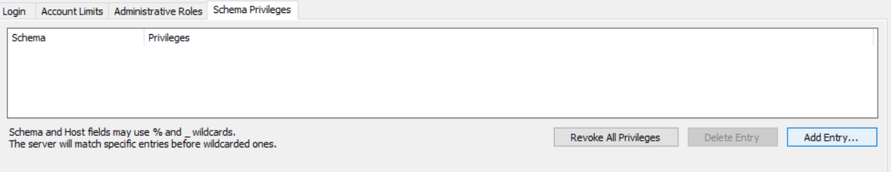
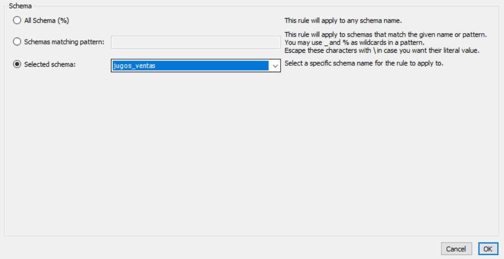
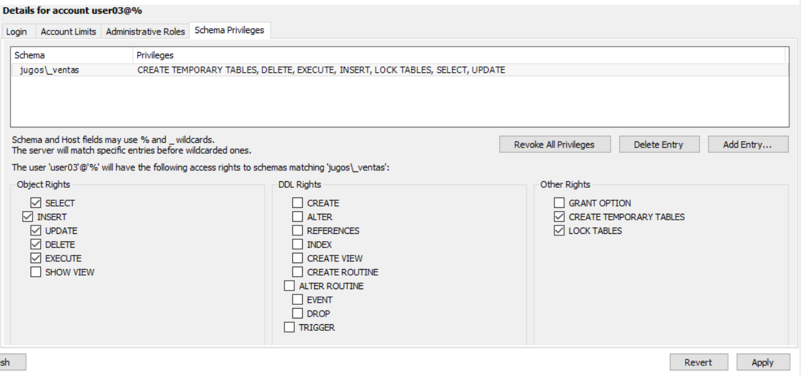
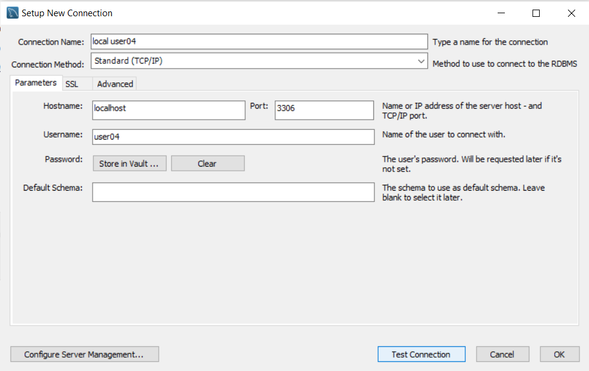
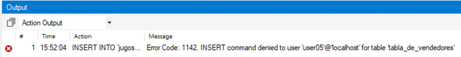

## Gestion de Privilegios

- Accediendo desde cualquier servidor
- Se usa % para habilitar conexion desde cualquier ip


```sql
    -- CREAR EL USUARIO
   CREATE USER 'ADMIN02'@'%' IDENTIFIED BY 'ADMIN02';

   -- HABILITAR PRIVILEGIOS
   GRANT ALL PRIVILEGES ON *.* TO 'ADMIN02'@'%' WITH GRANT OPTION;
```

Ejemplos:

- 192.168.1.%               => 192.168.1.0 - 192.168.1.255
- 192.168.1.1__             => 192.168.1.100 - 192.168.1.255
- client__.mycompany.com    => clientXY.mycompany.com
- 192.168.%                 => 192.168.0.0 - 192.168.255.255

### Limitando acceso a los esquemas:

```sql
    -- CREAR EL USUARIO CON PERMISOS A UN ESQUEMA
   CREATE USER 'USER02'@'%' IDENTIFIED BY 'USER02';

   -- HABILITAR PRIVILEGIOS
   GRANT    SELECT, 
            UPDATE,
            DELETE, 
            CREATE TEMPORARY TABLES,
            LOCK TABLES,
            EXECUTE
   ON jugos_ventas.* TO 'USER02'@'%';
```

```sql
    -- CREAR EL USUARIO CON PERMISOS A TABLA NADA MAS
    -- a la tabla facturas nada mas
   CREATE USER 'USER05'@'%' IDENTIFIED BY 'USER05';

   -- HABILITAR PRIVILEGIOS
   GRANT    SELECT, 
            UPDATE,
            DELETE, 
            CREATE TEMPORARY TABLES,
            LOCK TABLES,
            EXECUTE
   ON jugos_ventas.facturas TO 'USER05'@'%';
```

```sql
    -- CREAR EL USUARIO CON PERMISOS A de lectura
    -- a una tabla
   CREATE USER 'USER06'@'%' IDENTIFIED BY 'USER06';

   -- HABILITAR PRIVILEGIOS
   GRANT    SELECT
   ON jugos_ventas.tabla_vendedores TO 'USER06'@'%';
```


### Revocando los privilegios

```sql
    -- para ver los usuarios:
    SELECT * FROM mysql.user;

    -- ver los permisos de un usuario:
    SHOW GRANTS FOR 'USER02'@'LOCALHOST';

    -- PARA REVOCAR POR WORKBENCH O POR CODIGO:
    REVOKE ALL PRIVILEGES, GRANT OPTION FROM 'USER02'@'LOCALHOST';
```

## Resumen de la clase









Error cuando no tiene permisos:

